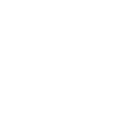

# MathTools


A math library I made to learn and explore math.

### Usage

Open up a terminal and go to the directory where you want to put Math Tools.

<br>

Clone the repo:

```bash
git clone https://github.com/martin-petersson/MathTools.git
```
Inside the same directory run the interactive Python interpreter:

```bash
$ python
```

```text
>>> from mathtools import Vector, Matrix
```

### Define a vector
```python
a = Vector([x, y])
```

#### Set scalar value of vector component
For components x, y, z and w.
```python
a.y = 10
```

#### Return size of vector
```python
a.size
```

#### Adding two vectors
```python
a + b
```
#### Multiply vector by scalar
```python
a * 0.78
```
#### Divide vector by scalar
```python
a / 2
```
#### Length of vector
```python
a.len
```

#### Euclidean distance
```python
a.distance(b)
```

#### Normalize/unitize vector
```python
a.unit
```
#### Dot product of two vectors
```python
a.dot(b)
```
#### Cross product of two 3d vectors
```python
a.cross(b)
```

#### Angle between two vectors
```python
a.angle(b)
```

#### Linear interpolation between two vectors
```python
t = 0.5
a.lerp(b, t)
```

### Define a matrix
```python
M = Matrix([[a, b], [c, d]])
```

#### Create identity matrix of size n
```python
I = Matrix.identity(n)
```

#### Create zero matrix of size m x n
```python
Z = Matrix.zeros(m, n)
```

#### Return size of matrix
```python
M.size
```

#### Add a matrix to a matrix
```python
M + A
```

#### Add a vector to a matrix
```python
v + M
```

#### Subtract a matrix from a matrix
```python
M - A
```

#### Multiply a matrix by a vector
```python
M @ v
```

#### Multiply a matrix by a matrix
```python
M @ A
```

#### Hadamard product of two matrices
```python
M * A
```

#### Hadamard product of two vectors
```python
a * b
```

#### Multiply every element of matrix by scalar
```python
M * 5
```

#### Transpose matrix
```python
M.transpose
```

#### Row vector (matrix)
```python
rowvec = v.row
```

#### Column vector (matrix)
```python
colvec = v.col
```

#### Matrix to vector
```python
colvec.to_vector
```
